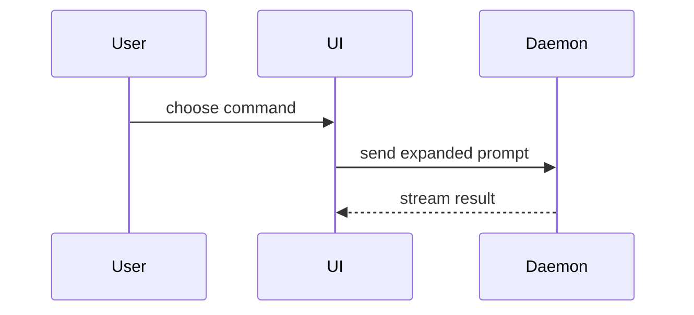

Help the user understand the current topic of conversation visually. Skip the preamble and keep
prose brief. Pick the smallest view that makes the key point clear.

## Scope and evidence

Use an inline diagram by default. Inspect relevant code before depicting an existing system. Label
proposed behavior and illustrative data; do not present them as observed implementation. A request
for an explanation does not authorize product changes, package installation, or external uploads.

Use code-native tools for diagrams, SVG, HTML, and CSS. Generate raster images only when requested
or necessary for the visual task and supported by an available authorized tool.

## Choose a view

- Show logic or an algorithm as pseudocode:

```text
on(save)
  if content is unchanged
    return cached result
  write new content
  return fresh result
```

- Show runtime control flow as a call tree:

```text
submitForm
  createSession
    persistPrompt
    launchAgent
  navigateToSession
```

- Show UI structure as a component tree, including state and module boundaries that matter:

```tsx
<SessionPage> (apps/example/src/routes/session.tsx)
  useSessionEvents()
  <SessionToolbar>
    <RunSkillButton> (packages/ui)
```

- Show file responsibility or a broad refactor as a shallow file tree:

```text
src/
├── commands/       # parses user actions
├── sessions/       # owns session state
└── transport/      # sends API requests
```

- Show component interaction, control flow, or data flow with Mermaid:



- Use `diff` when the point is what changes and the surrounding shape already exists. Match the diff
  shape to the topic.

For a component change:

```diff
 <SessionPage>
   useSessionEvents()
   <SessionToolbar>
+    <RunSkillButton />
   <SessionTimeline>
+    <SkillResultCard />
```

For a file-layout change:

```diff
 src/
 ├── commands/
+│   └── show-me.ts       # expands the slash command
 ├── sessions/
-└── transport.ts
+└── transport/
+    ├── client.ts
+    └── stream.ts
```

For a call-tree or call-stack change:

```diff
 submitForm
   createSession
     persistPrompt
+    expandSkillMention
     launchAgent
-  navigateToSession
+  navigateToSession
+    subscribeToEvents
```

For a state or control-flow change:

```diff
 on(save)
-  write content
+  if content is unchanged
+    return cached result
+  write new content
+  invalidate cache
```

- Show the whole block when most of it is new, when omitted context would hide ownership or order,
  or when the user needs a copyable target shape:

```ts
function expandSkill(command: string): string {
  const skillName = command.slice(1);
  return `use the ${skillName} skill`;
}
```

- For a visual UI, layout, state comparison, or concept too dense for Mermaid, write one focused
  HTML file — a diagram, an infographic, or a short slide deck, whichever fits the point. Match the
  product's colors, type, spacing, and components; use real labels and data; support desktop and
  mobile. Keep it self-contained where practical; do not load remote scripts, fonts, analytics, or
  private data into external services. Escape dynamic text rather than inserting unsafe HTML.

  Write only to a repository-approved artifact location or an authorized temporary directory, not to
  home-directory configs. Provide the local file path. Open it with an available platform-specific
  tool only when the user requests opening it; do not assume macOS `open` or a visible browser is
  available. Do not upload it to obtain a shareable URL.

- Place each visual next to the short text it supports. Keep only the calls, files, props, states,
  and boundaries needed to answer the user's current question.

You may use one of these, you may use several, it is unlikely you will use all of them. Use your
judgement and don't overwhelm the user.

## Verify and deliver

Check labels, arrows, ownership, and ordering against the source or explicitly stated proposal. For
HTML, check readable contrast, semantic structure, and overflow at the intended viewport sizes with
available tooling. Report when rendering was not checked. Deliver only the requested views and local
artifact links; do not install a browser to verify them without permission.
